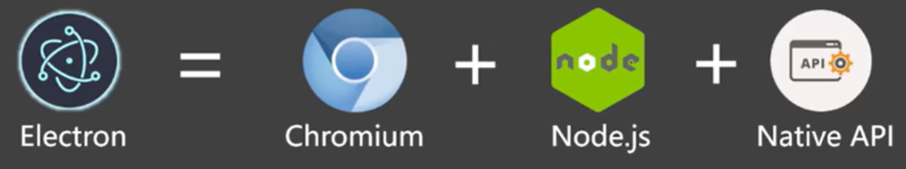

# Electron快速上手

## 1.什么是 Electron?

Electron 是一个**跨平台桌面应用开发框架**，开发者可以使用 HTML、CSS、JavaScript 等 Web 技术来构建桌面应用程序。它的本质是结合了 **Chromium** 和 **Node.js**，现在广泛用于桌面应用程序开发，例如这些桌面应用都用到了 Electron 技术：

- VisualStudioCode
- GitHubDesktop
- 1Password
- 新版 QQ

## 2. Electron 的优势

1. **可跨平台**：同一套代码可以构建出能在 Windows、macOS、Linux 上运行的应用程序。
2. **上手容易**：使用 Web 技术就可以轻松完成开发桌面应用程序。
3. **底层权限**：允许应用程序访问文件系统、操作系统等底层功能，从而实现复杂的系统交互。
4. **社区支持**：拥有一个庞大且活跃的社区，开发者可以轻松找到文档、教程和开源库。

## 3. Electron 技术架构

### 3.1 技术架构



- Chromium：页面渲染
- Node.js：后台操作
- Native API：系统级别的接口（如修改windows注册表）

### 3.2 进程模型

> 此处只是先了解一下进程模型，后面会详细讲解。


- 主进程：管理渲染进程
- 渲染进程：浏览器环境

## 4. 搭建一个工程

（1）**初始化一个包**，并填写好 package.json 中的必要信息及启动命令。

```markdown 
# 配置 package.json
npm init

# 安装 Electron
npm install electron --save-dev

```


注意：

- *入口点*应当是`main.js`
- *author*、*license*和*description*可以是任何值，但在稍后的[packaging](https://www.electronjs.org/zh/docs/latest/tutorial/打包教程 "packaging")中是必需的。

```json 
{
  "name": "electron_test",
  "version": "1.0.0",
  "main": "main.js",
  "scripts": {
    "start": "electron ." // start 命令用于启动整个应用
  },
  "author": "wdn",      // 为后续能顺利打包，此处要写明作者
  "license": "ISC",
  "description": "Electron Test", // 描述也必写
  "devDependencies": {
    "electron": "^36.4.0"
  }
}

```


（2）**安装 electron 作为开发依赖**。

```bash 
npm i electron -D
```


（3）**在 ****`main.js`**** 中编写代码**，创建一个基本窗口。

```javascript 
/*
main.js 运行在应用的主进程上，无法访问Web相关API，
主要负责：控制生命周期、显示界面、控制渲染进程等其他操作。
*/
const { app, BrowserWindow } = require('electron')
// ⽤于创建窗⼝
function createWindow() {
    const win = new BrowserWindow({
        width: 800, // 窗⼝宽度
        height: 600, // 窗⼝⾼度
        autoHideMenuBar: true, // ⾃动隐藏菜单栏
        alwaysOnTop: true, // 置顶
        x: 0, // 窗⼝位置x坐标
        y: 0 // 窗⼝位置y坐标
    })
    // 加载⼀个远程⻚⾯
    win.loadURL('https://wdndev.github.io/web_developement_note')
}

// 当app准备好后，执⾏createWindow创建窗⼝
app.on('ready',()=>{
    createWindow()
})
```


> 关于BrowserWindow 的更多配置项，请参考：[BaseWindow | Electron](https://www.electronjs.org/zh/docs/latest/api/base-window#实例属性 "BaseWindow | Electron")

（4）**启动应用查看效果**。

```bash 
npm start
```


效果如下：


## 5. 加载本地页面

（1）**创建 ****`pages/index.html`**** 和**\*\*`pages/index.css`\*\***编写内容**。

```html 
<!DOCTYPE html>
<html>
    <head>
        <meta charset="UTF-8" />
        <title>index</title>
        <link rel="stylesheet" href="./index.css" />
        <!-- <meta http-equiv="Content-Security-Policy" content="default-src 'self'; style-src 'self' 'unsafe-inline'; img-src 'self' data:;"> -->
    </head>
    <body>
        <h1>欢迎学习Electron开发</h1>
    </body>
</html>
```


```css 
h1 {
    background-color: aqua;
    color: chocolate;
}
```


（2）**修改 ****`main.js`**** 加载本地页面**。

```javascript 
win.loadFile('./pages/index.html')
```


此时，开发者工具会报出一个安全警告，需要修改 `index.html` ，配置 CSP(Content-Security-Policy)

```html 
<meta http-equiv="Content-Security-Policy" content="default-src 'self'; style-src 'self' 'unsafe-inline'; img-src 'self' data:;">
```


**配置说明**

1. **`default-src 'self'`**
   - `default-src`：配置加载策略，适用于所有未在其它指令中明确指定的资源类型。
   - `self`：仅允许从同源的资源加载，禁止从不受信任的外部来源加载，提高安全性。
2. **`style-src 'self' 'unsafe-inline'`**
   - `style-src`：指定样式表(CSS)的加载策略。
   - `self`：仅允许从同源的资源加载，禁止从不受信任的外部来源加载，提高安全性。
   - `unsafe-inline`：允许在HTML文档内使用内联样式。
3. **`img-src 'self' data`:**
   - `img-src`：指定图像资源的加载策略。
   - `self`：表示仅允许从同源加载图像。
   - `data`：允许使用 data: URI 来嵌入图像。这种URI模式允许将图像数据直接嵌入到HTML或CSS中，而不是通过外部链接引用。

关于 CSP 的详细说明请参考：[Content-Security-Policy (CSP) - HTTP | MDN](https://developer.mozilla.org/zh-CN/docs/Web/HTTP/Reference/Headers/Content-Security-Policy "Content-Security-Policy (CSP) - HTTP | MDN")

、[Security | Electron](https://www.electronjs.org/docs/latest/tutorial/security "Security | Electron")

## 6. 完善窗口行为

（1）**Windows 和 Linux 平台**：关闭所有窗口时退出应用。

```javascript 
// 当所有窗口关闭时
app.on('window-all-closed', () => {
  // 如果所处平台不是 mac(darwin)，则退出应用
  if (process.platform !== 'darwin') app.quit()
})
```


（2）**mac 平台**：即使在没有打开任何窗口的情况下也继续运行，并且在没有窗口可用的情况下激活应用时会打开新的窗口。

```javascript 
// 当app准备好后，执⾏createWindow创建窗⼝
app.whenReady().then(() => {
    console.log('app is ready')
    createWindow()
    // 当应⽤被激活时
    app.on('activate', () => {
        // 如果当前应⽤没有窗⼝，则创建⼀个新的窗⼝
        if (BrowserWindow.getAllWindows().length === 0) createWindow()
    })
})
```


## 7. 配置自动重启

（1）**安装 Nodemon**。

```bash 
npm i nodemon -D
```


（2）**修改 package.json 命令**。

```json 
"scripts": {
  "start": "nodemon --exec electron ."
}
```


（3）**配置 nodemon.json 规则**。

```json 
{
    "ignore": [
        "node_modules",
        "dist"
    ],
    "restartable": "r",
    "watch": ["*.*"],
    "ext": "html,js,css"
}
```


配置好以后，当代码修改后，应用就会自动重启了。

## 8. 主进程与渲染进程

Electron 应用的结构与 Chrome 浏览器的程序架构非常相似，在 Electron 中主要控制两类进程：主进程、渲染器进程。

### 8.1 主进程

每个 Electron 应用都有一个单一的主进程，作为应用程序的入口点。**主进程在 Node.js 环境中运行**，它具有 require 模块和使用所有 Node.js API 的能力，主进程的核心就是**使用 BrowserWindow 来创建和管理窗口**。

### 8.2 渲染进程

每个 BrowserWindow 实例都对应一个单独的渲染器进程，运行在渲染器进程中的代码，必须遵守网页标准，这也就意味着**渲染器进程无权直接访问 require 或使用任何 Node.js 的 API**。

> 问题产生：处于渲染器进程的用户界面，该怎样才与 Node.js 和 Electron 的原生桌面功能进行交互呢？

## 9. Preload 脚本

预加载(Preload)脚本是运行在渲染进程中的，但它是在**网页内容加载之前**执行的，这意味着它具有比普通渲染器代码更高的权限，可以访问 Node.js 的 API，同时又可以与网页内容进行安全的交互。简单说，它是 Node.js 和 Web API 的桥梁，Preload 脚本可以安全地将部分 Node.js 功能暴露给网页，从而减少安全风险。

> 需求示例：点击按钮后，在页面呈现当前的 Node 版本

（1）\*\*创建预加载脚本 \*\***`preload.js`**

```javascript 
console.log("preload")

const { contextBridge, ipcRenderer } = require("electron")
contextBridge.exposeInMainWorld("myAPI", {
    testVar: 666,
    nodeVersion: process.version
})
```


（2）\*\*在主线程中引入 \*\***`preload.js`**

```javascript 
const path = require('path')
// ⽤于创建窗⼝
function createWindow() {
    const win = new BrowserWindow({
        width: 800, // 窗⼝宽度
        height: 600, // 窗⼝⾼度
        autoHideMenuBar: true, // ⾃动隐藏菜单栏
        // alwaysOnTop: true, // 置顶
        // x: 0, // 窗⼝位置x坐标
        // y: 0, // 窗⼝位置y坐标
        webPreferences: {
            preload: path.join(__dirname, 'preload.js')
        }
    })
    win.loadFile("./pages/index.html")
}
```


（3）\*\*在 html 页面中编写对应按钮，并创建 \*\***`render.js`**

```html 
<body>
    <h1>欢迎学习Electron开发！</h1>
    <button id="btn1">点击</button>
    <script type="text/javascript" src="./render.js"></script>
</body>
```


（4）**在渲染进程中使用 version**。

```javascript 
const btn1 = document.getElementById("btn1");

btn1.onclick  = () => {
    console.log("Node Version: ", myAPI.nodeVersion);
    alert("Node Version: " + myAPI.nodeVersion);
};
```


文件的整体结构：


注意：上文中的 `preload.js` ，无法使用全部 `Node `的 API ，比如：不能使用 `Node` 中的 fs 模块，但主进程（ `main.js` ）是可以的，这时就需要**进程通信**了。简单说：要让 `preload.js` 通知 `main.js` 去调用 fs 模块去干活

## 10. 进程通信(IPC)

基本概念

- `IPC` 全称为 InterProcess Communication，即进程通信。
- `IPC` 是 Electron 中最为核心的内容，这是 UI 调用原生 API 的唯一方法。
- Electron 中，主要使用 [ipcMain](https://www.electronjs.org/zh/docs/latest/api/ipc-main "ipcMain") 和 [ipcRenderer](https://www.electronjs.org/zh/docs/latest/api/ipc-renderer "ipcRenderer") 来定义“通道”，进行进程通信。

### 10.1 渲染进程➡主进程（单向）

概述：在**渲染器进程**中 `ipcRenderer.send` 发送消息，在**主进程**中使用 `ipcMain.on` 接收消息。常用于在 **Web 中调用主进程的 API**。

> 需求示例：点击按钮后，在用户的 D 盘创建一个 `hello.txt` 文件，文件内容来自于用户输入

**（1）页面中添加相关元素，****`render.js`**** 中添加对应脚本。**

```html 
<input id="input" type="text" >
<button id="btn2">向D盘写入hello.txt</button>
```


```javascript 
const btn2  = document.getElementById("btn2");
const input = document.getElementById("input");

btn2.onclick = () => {
    console.log("Input Value: ", input.value);
    // alert("Input Value: " + input.value);
    myAPI.saveFile(input.value);
};
```


**（2）****`preload.js`**** 中使用 ****`ipcRenderer.send('信道',参数)`**** 发送消息。**

```javascript 
const { contextBridge, ipcRenderer } = require("electron")
contextBridge.exposeInMainWorld("myAPI", {
    testVar: 666,
    nodeVersion: process.version,
    saveFile: (data) => {
        ipcRenderer.send("save-file", data)
    }
})
```


**（3）主进程中配置对应回调函数接收消息。**

```javascript 
const fs = require('fs')

function writeFile(event, data) {
    fs.writeFileSync('D:/hello.txt', data)
}
// ⽤于创建窗⼝
function createWindow() {
    const win = new BrowserWindow({
        width: 800, // 窗⼝宽度
        height: 600, // 窗⼝⾼度
        autoHideMenuBar: true, // ⾃动隐藏菜单栏
        // alwaysOnTop: true, // 置顶
        // x: 0, // 窗⼝位置x坐标
        // y: 0, // 窗⼝位置y坐标
        webPreferences: {
            preload: path.join(__dirname, 'preload.js')
        }
    })
    ipcMain.on('save-file', writeFile)

    // 加载⼀个远程⻚⾯
    // win.loadURL('https://wdndev.github.io')
    win.loadFile("./pages/index.html")
}
```


### 10.2 渲染进程↔主进程（双向）

概述：渲染进程通过 `ipcRenderer.invoke` 发送消息，**主进程**使用`ipcMain.handle` 接收并处理消息。`ipcRender.invoke` 的返回值是 `Promise `实例。常用于**从渲染器进程调用主进程方法并等待结果**。

> 需求示例：点击按钮从 D 盘读取 hello.txt 中的内容，并将结果呈现在页面上

**（1）页面中添加相关元素，****`render.js`**** 中添加对应脚本。**

```html 
<button id="btn3">读取D盘中hello.txt</button>
```


```javascript 
const btn3  = document.getElementById("btn3");

btn3.onclick = async () => {
    let data = await myAPI.readFile()
    alert(data);
}

```


**（2）****`preload.js`**** 中使用 ****`ipcRenderer.invoke('信道',参数)`**** 发送消息。**

```javascript 
const { contextBridge, ipcRenderer } = require("electron")
contextBridge.exposeInMainWorld("myAPI", {
    testVar: 666,
    nodeVersion: process.version,
    saveFile: (data) => {
        ipcRenderer.send("save-file", data)
    },
    readFile() {
        return ipcRenderer.invoke("read-file")
    }
})
```


**（3）主进程中，在加载页面之前，使用 ****`ipcMain.handle('信道',回调)`**** 接收消息，并配置回调函数。**

```javascript 
function readFile(event) {
    const res = fs.readFileSync('D:/hello.txt', 'utf-8').toString()
    console.log('###: ', res)
    return res
}
// ⽤于创建窗⼝
function createWindow() {
    const win = new BrowserWindow({
        width: 800, // 窗⼝宽度
        height: 600, // 窗⼝⾼度
        autoHideMenuBar: true, // ⾃动隐藏菜单栏
        // alwaysOnTop: true, // 置顶
        // x: 0, // 窗⼝位置x坐标
        // y: 0, // 窗⼝位置y坐标
        webPreferences: {
            preload: path.join(__dirname, 'preload.js')
        }
    })
    ipcMain.on('save-file', writeFile)
    ipcMain.handle('read-file', readFile)

    // 加载⼀个远程⻚⾯
    // win.loadURL('https://wdndev.github.io')
    win.loadFile("./pages/index.html")
}
```


### 10.3 主进程到➡渲染进程

概述：**主进程**使用 `win.webContents.send` 发送消息，渲染进程通过 `ipcRenderer.on` 处理消息，常用于**从主进程主动发送消息给渲染进程**。

> 需求示例：应用加载 6 秒钟后，主动给渲染进程发送一个消息，内容是：你好啊!

**（1）页面中添加相关元素，****`render.js`**** 中添加对应脚本。**

```javascript 
window.onload = () => {
    myAPI.getMsg(logMsg)
};

function logMsg(event, str) {
    console.log(event, str);
}

```


**（2）****`preload.js`**** 中使用 ****`ipcRenderer.on ('信道',回调)`**** 接收消息。**

```javascript 
const { contextBridge, ipcRenderer } = require("electron")

contextBridge.exposeInMainWorld("myAPI", {
    testVar: 666,
    nodeVersion: process.version,
    saveFile: (data) => {
        ipcRenderer.send("save-file", data)
    },
    readFile() {
        // let x = await ipcRenderer.invoke("read-file")
        // console.log('@@@: ', x)
        return ipcRenderer.invoke("read-file")
    },
    getMsg: (callback) => {
        return ipcRenderer.on("message", callback)
    },
})
```


**（3）主进程中，在合适的时候，使用 ****`win.webContents.send('信道',数据)`**** 发送消息。**

```javascript 
// ⽤于创建窗⼝
function createWindow() {
    const win = new BrowserWindow({
        width: 800, // 窗⼝宽度
        height: 600, // 窗⼝⾼度
        autoHideMenuBar: true, // ⾃动隐藏菜单栏
        // alwaysOnTop: true, // 置顶
        // x: 0, // 窗⼝位置x坐标
        // y: 0, // 窗⼝位置y坐标
        webPreferences: {
            preload: path.join(__dirname, 'preload.js')
        }
    })
    ipcMain.on('save-file', writeFile)
    ipcMain.handle('read-file', readFile)

    // 加载⼀个远程⻚⾯
    // win.loadURL('https://wdndev.github.io')
    win.loadFile("./pages/index.html")

    // 创建一个定时器
    setTimeout(() => {
        win.webContents.send('message', 'wdn, 你好啊！')
    }, 6000)
}
```


## 11. 打包应用

使用 `electron-builder` 打包应用。

（1）**安装 electron-builder**。

```bash 
npm install electron-builder -D
```


（2）**在 package.json 中进行相关配置**。

```json 
{
    "name": "video-tools", // 应用程序的名称
    "version": "1.0.0", // 应用程序的版本
    "main": "main.js", // 应用程序的入口文件
    "scripts": {
        "start": "electron .", // 使用 `electron .` 命令启动应用程序
        "build": "electron-builder" // 使用 `electron-builder` 打包应用程序，生成安装包
    },
    "build": {
        "appId": "com.atguigu.video", // 应用程序的唯一标识符
        // 打包windows平台安装包的具体配置
        "win": {
            "icon": "./logo.ico", //应用图标
            "target": [
                {
                    "target": "nsis", // 指定使用 NSIS 作为安装程序格式
                    "arch": ["x64"] // 生成 64 位安装包
                }
            ]
        },
        "nsis": {
            "oneClick": false, // 设置为 `false` 使安装程序显示安装向导界面，而不是一键安装
            "perMachine": true, // 允许每台机器安装一次，而不是每个用户都安装
            "allowToChangeInstallationDirectory": true // 允许用户在安装过程中选择安装目录
        }
    },
    "devDependencies": {
        "electron": "^30.0.0", // 开发依赖中的 Electron 版本
        "electron-builder": "^24.13.3" // 开发依赖中的 `electron-builder` 版本
    },
    "author": "tianyu", // 作者信息
    "license": "ISC", // 许可证信息
    "description": "A video processing program based on Electron" // 应用程序的描述
}
```


（3）**执行打包命令**。

```bash 
npm run build
```


## 12. electron-vite

electron-vite 是一个新型构建工具，旨在为 Electron 提供更快、更精简的体验。主要由五部分组成：

1. 一套构建指令，它使用 Vite 打包你的代码，并且它能够处理 Electron 的独特环境，包括 Node.js 和浏览器环境。
2. 集中配置主进程、渲染器和预加载脚本的 Vite 配置，并针对 Electron 的独特环境进行预配置。
3. 为渲染器提供快速模块热替换(HMR)支持，为主进程和预加载脚本提供热重载支持，极大地提高了开发效率。
4. 优化 Electron 主进程资源处理。
5. 使用 V8 字节码保护源代码。

electron-vite 快速、简单且功能强大，旨在开箱即用。官网地址：[https://cn-evite.netlify.app/](https://cn-evite.netlify.app/ "https://cn-evite.netlify.app/")
