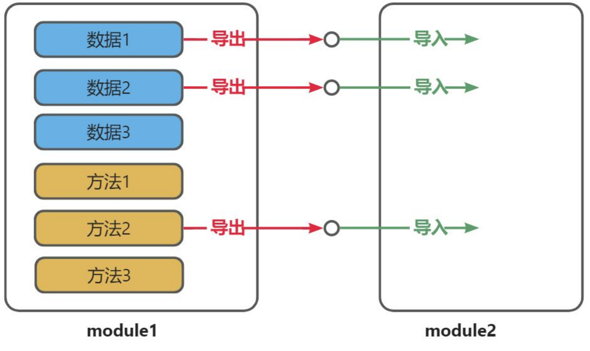
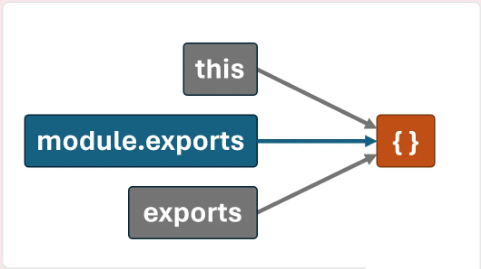

# JavaScript 模块化规范

## 1. 模块化概述

### 1.1. 什么是模块化?

- 将程序文件依据⼀定规则**拆分**成多个文件，这种编码方式就是**模块化**的编码方式。
- 拆分出来**每个文件就是⼀个模块**，模块中的数据都是**私有的**，模块之间互相**隔离**。
- 同时也能通过⼀些手段，可以把模块内的指定数据“**交出去**”，供其他模块使用。

### 1.2. 为什么需要模块化?

随着应用的复杂度越来越高，其代码量和文件数量都会急剧增加，会逐渐引发以下问题：

- 全局污染问题
- 依赖混乱问题
- 数据安全问题

## 2. 有哪些模块化规范?

历史背景(了解即可)：2009 年，随着 `Node.js` 的出现，`JavaScript` 在服务器端的应用逐渐增多，为了让 `Node.js` 的代码更好维护，就必须要制定一种 `Node.js` 环境下的模块化规范，来自 Mozilla 的工程师 Kevin Dangoor 提出了 `CommonJS` 规范(`CommonJS` 初期的名字叫 `ServerJS`)，随后 `Node.js` 社区采纳了这一规范。

随着时间的推移，针对 `JavaScript` 的不同运行环境，相继出现了多种模块化规范，按时间排序，分别为：

1. **`CommonJS`**——**服务端应用广泛**
2. AMD&#x20;
3. CMD
4. \*\*ES6 模块化规范 \*\*—— **浏览器端应用广泛**

## 3. 导入与导出的概念

模块化的核心思想就是：模块之间是**隔离的**，通过**导入**和**导出**进行数据和功能的共享。

- **导出(暴露)**：模块公开其内部的一部分(如变量、函数等)，使这些内容可以被其他模块使用。
- **导入(引入)**：模块引入和使用其他模块导出的内容，以重用代码和功能。



## 4. CommonJS 规范

### 4.1. 初步体验

\*\*（1）创建 \*\***`school.js`**

```javascript 
const name = '尚硅谷'
const slogan = '让天下没有难学的技术！'

function getTel (){
  return '010-56253825'
}

function getCities(){
  return ['北京','上海','深圳','成都','武汉','西安']
}

// 通过给exports对象添加属性的方式,来导出数据(注意:此处没有导出getCities)
exports.name = name
exports.slogan = slogan
exports.getTel = getTel
```


\*\*（2）创建 \*\***`student.js`**

```javascript 
const name = '张三'
const motto = '相信明天会更好！'

function getTel (){
  return '13877889900'
}

function getHobby(){
  return ['抽烟','喝酒','烫头']
}

// 通过给exports对象添加属性的方式,来导出数据(注意:此处没有导出getHobby)
exports.name = name
exports.slogan = slogan
exports.getTel = getTel
```


**（3）** ​**创建 index.js**

```javascript 
// 引入school模块暴露的所有内容
const school = require('./school')

// 引入student模块暴露的所有内容 
const student = require('./student')
```


### 4.2. 导出数据

在 CommonJS 标准中，导出数据有两种方式：

- 第一种方式：`module.exports = value`
- 第二种方式：`exports.name = value`

注意点如下：

1. 每个模块内部的：`this`、`exports`、`modules.exports` 在初始时，都指向**同一个**空对象，该空对象就是当前模块导出的数据。

   
2. **无论如何修改导出对象，最终导出的都是 ****`module.exports`**** 的值**。
3. `exports` 是对 `module.exports` 的初始引用，仅为了方便给导出对象添加属性，所以不能使用 `exports = value` 的形式导出数据，但是可以使用 `module.exports = xxxx` 导出数据。

```javascript 
// 第一种方式
module.exports = {name,motto,getTel}

// // 第二种方式
// exports.name = name
// exports.motto = motto
// exports.getTel = getTel
```


### 4.3. 导入数据

在 CJS 模块化标准中，使用内置的 require 函数进行导入数据

```javascript 
// 直接引入模块
const school = require('./school')

// 引入同时解构出要用的数据 
const { name, slogan, getTel } = require('./school')

// 引入同时解构+重命名
const {name:stuName,motto,getTel:stuTel} = require('./student')
```


### 4.4. 扩展理解

一个 JS 模块在执行时，是被包裹在一个**内置函数**中执行的，所以每个模块都有自己的作用域，我们可以通过如下方式验证这一说法：

```javascript 
console.log(arguments)
console.log(arguments.callee.toString())
```


内置函数的大致形式如下：

```javascript 
function (exports, require, module, __filename, __dirname){
  /*********************/
}
```


### 4.5. 浏览器端运行

`Node.js` 默认是支持 `CommonJS` 规范的，但浏览器端不支持，所以需要经过编译，步骤如下：

- 第一步：全局安装 browserify : `npm i browserify -g`
- 第二步：编译

```bash 
browserify index.js -o build.js
```


备注：`index.js` 是源文件，`build.js` 是输出的目标文件。

- 第三步：页面中引入使用

```html 
<script type="text/javascript" src="./build.js"></script>
```


## 5. ES6 模块化规范

ES6 模块化规范是一个**官方标准**的规范，它是在语言标准的层面上实现了模块化功能，是目前**最流行**的模块化规范，且**浏览器与服务端均支持该规范**。

### 5.1. 初步体验

\*\*（1）创建 \*\***`school.js`**

```javascript 
// 导出 name
export const name = '尚硅谷'
const slogan = '让天下没有难学的技术！'

function getTel (){
  return '010-56253825'
}

function getCities(){
  return ['北京','上海','深圳','成都','武汉','西安']
}
// 导出 slogan
export {slogan}
// 导出 getTel
export default getTel
```


\*\*（2）创建 \*\***`student.js`**

```javascript 
const name = '张三'
const motto = '相信明天会更好！'

function getTel (){
  return '13877889900'
}

function getHobby(){
  return ['抽烟','喝酒','烫头']
}

export {name,motto,getTel}
```


\*\*（3）创建 \*\***`index.js`**

```javascript 
// 引入school模块暴露的所有内容 
import * as school from './school.js'

// 引入student模块暴露的所有内容 
import * as student from './student.js'
```


\*\*（4）页面中引入 \*\***`index.js`**

```html 
<script type="module" src="./index.js"></script>
```


### 5.2. Node 中运行 ES6 模块

`Node.js` 中运行 `ES6` 模块代码有两种方式：

- 方式一：将 JavaScript 文件后缀从 `.js` 改为 `.mjs`，Node 则会自动识别 ES6 模块。
- 方式二：在 `package.json` 中设置 `type` 属性值为 `module`。

### 5.3. 导出数据

ES6 模块化提供 3 种导出方式：①分别导出、②统一导出、③默认导出。

**（1）分别导出**

备注：在上方【初步体验中】环节，我们使用的导出方式就是【分别导出】

```javascript 
// 导出name
export let name = {str:'尚硅谷'} 
// 导出slogan
export const slogan = '让天下没有难学的技术!'
// 导出getTel
export function getTel (){
  return '010-56253825'
}
```


**（2）统一导出**

```javascript 
const name = '张三'
const motto = '相信明天会更好！'

function getTel (){
  return '13877889900'
}

function getHobby(){
  return ['抽烟','喝酒','烫头']
}

// 统⼀导出了：name,slogan,getTel
export {name,motto,getTel}
```


**（3）** ​**默认导出**

```javascript 
const name = '张三'
const motto = '相信明天会更好！'

function getTel (){
  return '13877889900'
}

function getHobby(){
  return ['抽烟','喝酒','烫头']
}

// 默认导出：name,slogan,getTel
export default {name,motto,getTel}
```


备注：上述多种导出方式，可以同时使用。

```javascript 
// 导出name ———— 分别导出 
export const name = '尚硅谷'
const slogan = '让天下没有难学的技术！'

function getTel (){
  return '010-56253825'
}

function getCities(){
  return ['北京','上海','深圳','成都','武汉','西安']
}
// 导出slogan ———— 统⼀导出
export {slogan}
// 导出getTel ———— 默认导出
export default getTel
```


### 5.4. 导入数据

对于 ES6 模块化来说，使用何种**导入方式**，要根据**导出方式**决定。

**（1）****导入全部****(通用)**

可以将模块中的所有导出内容整合到一个对象中。

```javascript 
import * as school from './school.js'
```


**（2）命名导入（对应导出方式：分别导出、统一导出）**

导出数据的模块

```javascript 
//分别导出 
export const name = {str:'尚硅谷'} 
//分别导出 
export const slogan = '让天下没有难学的技术!'
function getTel (){ 
  return '010-56253825'
}

function getCities() {
  return ['北京','上海','深圳','成都','武汉','西安']
}
//统一导出
export { getTel }
```


命名导入：

```javascript 
import { name,slogan,getTel } from './school.js'
```


通过 as 重命名：

```javascript 
import { name as myName,slogan,getTel } from './school.js'
```


**（3）默认导入（对应导出方式：默认导出）**

导出数据的模块

```javascript 
const name = '张三'
const motto = '相信明天会更好！'

function getTel (){
  return '13877889900'
}

function getHobby(){
  return ['抽烟','喝酒','烫头']
}

//使用默认导出的方式,导出一个对象,对象中包含着数据
export default { name,motto,getTel }
```


默认导入：

```javascript 
//默认导出的名字可以修改,不是必须为student
import student from './student.js' 
```


**（4）命名导入与默认导入可以混合使用**

导出数据的模块

```javascript 
// 导出name ———— 分别导出 
export const name = '尚硅谷'
const slogan = '让天下没有难学的技术！'

function getTel (){
  return '010-56253825'
}

function getCities(){
  return ['北京','上海','深圳','成都','武汉','西安']
}
// 导出slogan ———— 统⼀导出
export {slogan}
// 导出getTel ———— 默认导出
export default getTel
```


**命名导入**与**默认导入**混合使用，且**默认导入的内容必须放在前方**：

```javascript 
import getTel,{name,slogan} from './school.js'
```


**（5）动态导入(通用)**

允许在运行时**按需加载**模块，返回值是一个 Promise。

```javascript 
const school = await import('./school.js');
console.log(school)
```


**（6）import 可以不接收任何数据**

例如只是让 `mock.js` 参与运行

```javascript 
import './mock.js'
```


> 此时，我们感受到模块化确实解决了：①全局污染问题、②依赖混乱问题、③数据安全问题。

### 5.5. 数据引用问题

**思考1**: 如下代码的输出结果是什么?(不要想太多,不涉及模块化相关知识)

```javascript 
function count (){
    let sum = 1
    function increment(){
        sum += 1
    }
    return {sum,increment}
}

const {sum,increment} = count()

console.log(sum)
increment()
increment()
console.log(sum)
```


运行结果：

```html 
1
1
```


**思考2**：使用 CommonJS 规范,编写如下代码,输出结果是什么?

`count.js `

```javascript 
let sum = 1
function increment (){
  sum += 1
}

module.exports = {sum,increment}
```


`index.js`

```javascript 
const {sum, increment} = require('./count.js')
console.log(sum) 
increment()
increment()
console.log(sum)
```


运行结果：

```text 
1
1
```


**思考3**：使用 ES6 模块化规范,编写如下代码,输出结果是什么?

`count.js`

```javascript 
let sum = 1
function increment (){
  sum += 1
}

export {sum,increment}
```


`index.js`

```javascript 
import {sum,increment} from './count.js'
console.log(sum) //1 
increment()
increment() 
console.log(sum) //3
```


```html 
1
3
```


使用原则：导出的常量，务必用 `const` 定义。

## 6. AMD 模块化规范(了解)

## 7. CMD 模块化规范(了解)
