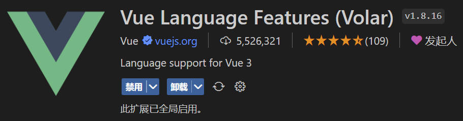
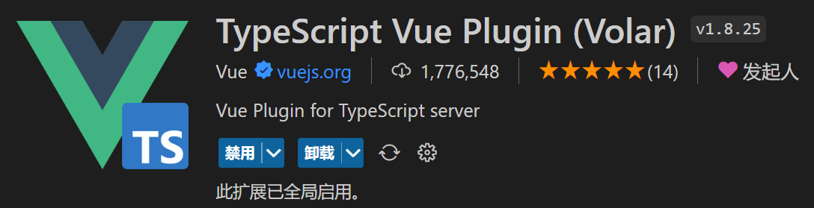

# 2.创建工程

## 1.基于 vue-cli 创建

点击查看[官方文档](https://cli.vuejs.org/zh/guide/creating-a-project.html#vue-create "官方文档")

> 备注：目前`vue-cli`已处于维护模式，官方推荐基于 `Vite` 创建项目。

```powershell 
## 查看@vue/cli版本，确保@vue/cli版本在4.5.0以上
vue --version

## 安装或者升级你的@vue/cli 
npm install -g @vue/cli

## 执行创建命令
vue create vue_test

##  随后选择3.x
##  Choose a version of Vue.js that you want to start the project with (Use arrow keys)
##  > 3.x
##    2.x

## 启动
cd vue_test
npm run serve
```


***

## 2.基于 vite 创建(推荐)

### 2.1 简介

`vite` 是新一代前端构建工具，官网地址：[https://vitejs.cn](https://vitejs.cn/ "https://vitejs.cn")，`vite`的优势如下：

- 轻量快速的热重载（`HMR`），能实现极速的服务启动。
- 对 `TypeScript`、`JSX`、`CSS` 等支持开箱即用。
- 真正的按需编译，不再等待整个应用编译完成。
- `webpack`构建 与 `vite`构建对比图如下：


  

  

### 2.2 创建项目

- 具体操作如下（点击查看[官方文档](https://cn.vuejs.org/guide/quick-start.html#creating-a-vue-application "官方文档")）

```powershell 
## 1.创建命令
npm create vue@latest

pnpm create vite

## 2.具体配置
## 配置项目名称
√ Project name: vue3_test
## 是否添加TypeScript支持
√ Add TypeScript?  Yes
## 是否添加JSX支持
√ Add JSX Support?  No
## 是否添加路由环境
√ Add Vue Router for Single Page Application development?  No
## 是否添加pinia环境
√ Add Pinia for state management?  No
## 是否添加单元测试
√ Add Vitest for Unit Testing?  No
## 是否添加端到端测试方案
√ Add an End-to-End Testing Solution? » No
## 是否添加ESLint语法检查
√ Add ESLint for code quality?  Yes
## 是否添加Prettiert代码格式化
√ Add Prettier for code formatting?  No
```


- 附加命令创建项目

```markdown 
# 通过附加的命令行选项直接指定项目名称和你想要使用的模板

# npm 7+，需要添加额外的 --
npm create vite@latest my-vue-app -- --template vue


pnpm create vite my-vue-app --template vue

```


查看[create-vite](https://github.com/vitejs/vite/tree/main/packages/create-vite "create-vite")以获取每个模板的更多细节：`vanilla`，`vanilla-ts`，`vue`，`vue-ts`，`react`，`react-ts`，`react-swc`，`react-swc-ts`，`preact`，`preact-ts`，`lit`，`lit-ts`，`svelte`，`svelte-ts`，`solid`，`solid-ts`，`qwik`，`qwik-ts`。

可以使用`.`作为项目名称，在当前目录中创建项目脚手架。

### 2.3 项目结构

项目目录：

```markdown 
my-vue-app/
├── node_modules/    # 所有安装的依赖包
├── public/          # 静态资源（直接复制，不处理）
│   └── favicon.ico  # 网站图标
├── src/             # 源代码目录
│   ├── assets/      # 图片等需处理的静态资源
│   ├── components/  # Vue组件（如HelloWorld.vue）
│   ├── App.vue      # 根组件
│   ├── main.ts      # 应用入口文件
│   └── env.d.ts     # TS类型声明文件（解决.vue文件导入问题）
├── index.html       # 主页面入口（Vite自动注入脚本）
├── package.json     # 项目配置和依赖管理
├── tsconfig.json    # TypeScript配置
└── vite.config.ts   # Vite配置（已集成Vue插件）
```


核心文件作用

1. **index.html**：应用容器（包含`<div id="app">`）
2. **main.ts**：初始化Vue应用并挂载到DOM
3. **App.vue**：根组件（包含基础页面结构）
4. **vite.config.ts**：构建配置（默认启用Vue支持）
5. **tsconfig.json**：TypeScript编译规则

常用命令

- `pnpm dev`：启动开发服务器
- `pnpm build`：生成生产环境代码（输出到`dist/`目录）
- `pnpm preview`：本地预览构建结果

### 2.4 示例

自己动手编写一个App组件

```vue 
<template>
  <div class="app">
    <h1>你好啊！</h1>
  </div>
</template>

<script lang="ts">
  export default {
    name:'App' //组件名
  }
</script>

<style>
  .app {
    background-color: #ddd;
    box-shadow: 0 0 10px;
    border-radius: 10px;
    padding: 20px;
  }
</style>
```


### 2.5 vscode插件

安装官方推荐的`vscode`插件：





### 2.6总结

- `Vite` 项目中，`index.html` 是项目的入口文件，在项目最外层。
- 加载`index.html`后，`Vite` 解析 `<script type="module" src="xxx">` 指向的`JavaScript`。
- `Vue3`中是通过 `createApp` 函数创建一个应用实例。

## 3.一个简单的效果

`Vue3`向下兼容`Vue2`语法，且`Vue3`中的模板中可以没有根标签

```vue 
<template>
  <div class="person">
    <h2>姓名：{{name}}</h2>
    <h2>年龄：{{age}}</h2>
    <button @click="changeName">修改名字</button>
    <button @click="changeAge">年龄+1</button>
    <button @click="showTel">点我查看联系方式</button>
  </div>
</template>

<script lang="ts">
  export default {
    name:'App',
    data() {
      return {
        name:'张三',
        age:18,
        tel:'13888888888'
      }
    },
    methods:{
      changeName(){
        this.name = 'zhang-san'
      },
      changeAge(){
        this.age += 1
      },
      showTel(){
        alert(this.tel)
      }
    },
  }
</script>
```


