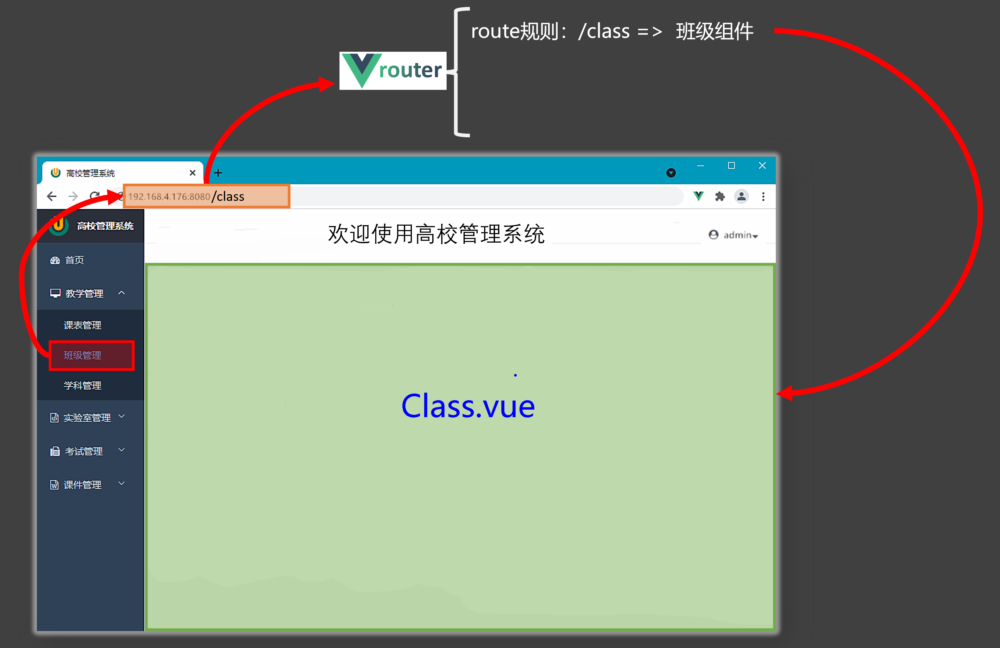

# 4.路由

## 1.对路由的理解

- 路由是一组key-value的对应关系
- 多个路由，需要经过路由器的管理




## 2.基本切换效果

### 2.1 基本实现

> 1\. 导航区、展示区
> 2.请来路由器
> 3.指定路由的具体规则（什么路径，对应什么组件）
> 4.形成一个一个的 【???.vue】 组件

- `Vue3`中要使用`vue-router`的最新版本，目前是`4`版本。
- 路由配置文件代码如下：
  ```javascript 
  import {createRouter,createWebHistory} from 'vue-router'
  import Home from '@/pages/Home.vue'
  import News from '@/pages/News.vue'
  import About from '@/pages/About.vue'

  const router = createRouter({
    history:createWebHistory(),
    routes:[
      {
        path:'/home',
        component:Home
      },
      {
        path:'/about',
        component:About
      }
    ]
  })
  export default router
  ```

- `main.ts`代码如下：
  ```javascript 
  import router from './router/index'
  app.use(router)

  app.mount('#app')
  ```

- `App.vue`代码如下
  ```vue 
  <template>
    <div class="app">
      <h2 class="title">Vue路由测试</h2>
      <!-- 导航区 -->
      <div class="navigate">
        <RouterLink to="/home" active-class="active">首页</RouterLink>
        <RouterLink to="/news" active-class="active">新闻</RouterLink>
        <RouterLink to="/about" active-class="active">关于</RouterLink>
      </div>
      <!-- 展示区 -->
      <div class="main-content">
        <RouterView></RouterView>
      </div>
    </div>
  </template>

  <script lang="ts" setup name="App">
    import {RouterLink,RouterView} from 'vue-router'  
  </script>
  ```


### 2.3 两个注意点

1. **路由组件**通常存放在`pages` 或 `views`文件夹，**一般组件**通常存放在`components`文件夹。
2. 通过点击导航，视觉效果上“消失” 了的路由组件，默认是被**卸载**掉的，需要的时候再去**挂载**。

## 3.路由器工作模式

### 3.1 `history`模式

- 优点：`URL`更加美观，不带有`#`，更接近传统的网站`URL`。

- 缺点：后期项目上线，需要服务端配合处理路径问题，否则刷新会有`404`错误。

```javascript 
const router = createRouter({
    history:createWebHistory(), //history模式
    /******/
})
```


### 3.2 `hash`模式

- 优点：兼容性更好，因为不需要服务器端处理路径。

- 缺点：`URL`带有`#`不太美观，且在`SEO`优化方面相对较差。

```typescript 
const router = createRouter({
    history:createWebHashHistory(), //hash模式
    /******/
})
```


## 4.to的两种写法

```vue 
<!-- 第一种：to的字符串写法 -->
<router-link active-class="active" to="/home">主页</router-link>

<!-- 第二种：to的对象写法 -->
<router-link active-class="active" :to="{path:'/home'}">Home</router-link>
```


## 5.命名路由

作用：可以简化路由跳转及传参（后面就讲）。

给路由规则命名：

```javascript 
routes:[
  {
    name:'zhuye',
    path:'/home',
    component:Home
  },
  {
    name:'xinwen',
    path:'/news',
    component:News,
  },
  {
    name:'guanyu',
    path:'/about',
    component:About
  }
]
```


跳转路由：

```vue 
<!--简化前：需要写完整的路径（to的字符串写法） -->
<router-link to="/news/detail">跳转</router-link>

<!--简化后：直接通过名字跳转（to的对象写法配合name属性） -->
<router-link :to="{name:'guanyu'}">跳转</router-link>
```


## 6.嵌套路由

1. 编写`News`的子路由：`Detail.vue`
2. 配置路由规则，使用`children`配置项：
   ```typescript 
   const router = createRouter({
     history:createWebHistory(),
     routes:[
       {
         name:'zhuye',
         path:'/home',
         component:Home
       },
       {
         name:'xinwen',
         path:'/news',
         component:News,
         children:[
           {
             name:'xiang',
             path:'detail',
             component:Detail
           }
         ]
       },
       {
         name:'guanyu',
         path:'/about',
         component:About
       }
     ]
   })
   export default router
   ```

3. 跳转路由（记得要加完整路径）：
   ```vue 
   <router-link to="/news/detail">xxxx</router-link>
   <!-- 或 -->
   <router-link :to="{path:'/news/detail'}">xxxx</router-link>
   ```

4. 记得去`Home`组件中预留一个`<router-view>`
   ```vue 
   <template>
     <div class="news">
       <nav class="news-list">
         <RouterLink v-for="news in newsList" :key="news.id" :to="{path:'/news/detail'}">
           {{news.name}}
         </RouterLink>
       </nav>
       <div class="news-detail">
         <RouterView/>
       </div>
     </div>
   </template>
   ```


## 7.路由传参

### 7.1 query参数

1. 传递参数
   ```vue 
   <!-- 跳转并携带query参数（to的字符串写法） -->
   <!-- <RouterLink :to="`/news/detail?id=${item.id}&title=${item.title}&content=${item.content}`">{{ item.title }}</RouterLink> -->
           
   <!-- 跳转并携带query参数（to的对象写法） -->
   <RouterLink 
       :to="{
         path: '/news/detail', 
         query: {
           id: item.id, 
           title: item.title, 
           content: item.content
         }
       }"
   >
     {{ item.title }}
   </RouterLink>
   ```

2. 接收参数：
   ```typescript 
   import {useRoute} from 'vue-router'
   const route = useRoute()
   // 打印query参数
   console.log(route.query)
   ```


### 7.2 params参数

1. 传递参数
   ```vue 
   <!-- 跳转并携带params参数（to的字符串写法） -->
   <RouterLink :to="`/news/detail/${item.id}/${item.title}/${item.content}`">{{ item.title }}</RouterLink>

   <!-- 跳转并携带params参数（to的对象写法） -->
   <RouterLink 
     :to="{
       name:'xiangqing', //用name跳转
       params:{
         id:item.id,
         title:item.title,
         content:item.content
       }
     }"
   >
     {{item.title}}
   </RouterLink>
   ```

2. 接收参数：
   ```javascript 
   import {useRoute} from 'vue-router'
   const route = useRoute()
   // 打印params参数
   console.log(route.params)
   ```


**注意**：

1. 传递`params`参数时，若使用`to`的对象写法，必须使用`name`配置项，不能用`path`。

2. 传递`params`参数时，需要提前在规则中占位。添加`?`配置参数的必要性

## 8.路由的props配置

作用：让路由组件更方便的收到参数（可以将路由参数作为`props`传给组件）

1. **布尔写法**：把收到了每一组params参数，作为props传给Detail组件
   ```json 
   props:true
   ```

2. **函数写法**：把返回的对象中每一组key-value作为props传给Detail组件
   ```javascript 
   props(route){
     return route.query
   }
   ```

3. **对象写法**（用的少）：把对象中的每一组key-value作为props传给Detail组件
   ```json 
   props:{a:1,b:2,c:3}
   ```


```javascript 
{
  name:'xiang',
  path:'detail/:id/:title/:content',
  component:Detail,

  // props的对象写法，作用：把对象中的每一组key-value作为props传给Detail组件
  // props:{a:1,b:2,c:3}, 

  // props的布尔值写法，作用：把收到了每一组params参数，作为props传给Detail组件
  // props:true
  
  // props的函数写法，作用：把返回的对象中每一组key-value作为props传给Detail组件
  props(route){
    return route.query
  }
}
```


## 9.replace属性

1. 作用：控制路由跳转时操作浏览器历史记录的模式。
2. 浏览器的历史记录有两种写入方式：分别为`push`和`replace`：
   - `push`是追加历史记录（默认值）。
   - `replace`是替换当前记录。
3. 开启`replace`模式：
   ```vue 
   <RouterLink replace .......>News</RouterLink>
   ```


## 10.编程式导航

路由组件的两个重要的属性：`$route`和`$router`变成了两个`hooks`

```javascript 
import {useRoute,useRouter} from 'vue-router'

const route = useRoute()
const router = useRouter()

console.log(route.query)
console.log(route.parmas)
console.log(router.push)
console.log(router.replace)
```


```javascript 
const router = useRouter()

interface NewsInter {
  id: string;
  title: string;
  content: string;
}

function showNewsDetail(item: NewsInter) {
  router.push({
    name:'xiangqing', //用name跳转
    params: {
      id: item.id,
      title: item.title,
      content: item.content
    }
  })
}
```


## 11.重定向

1. 作用：将特定的路径，重新定向到已有路由。
2. 具体编码：
   ```json 
   {
       path:'/',
       redirect:'/about'
   }
   ```


