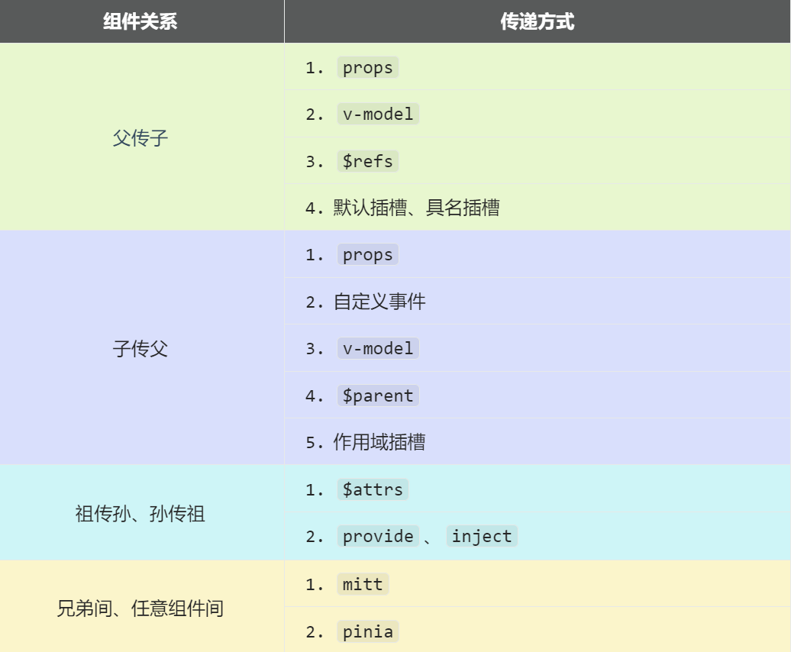
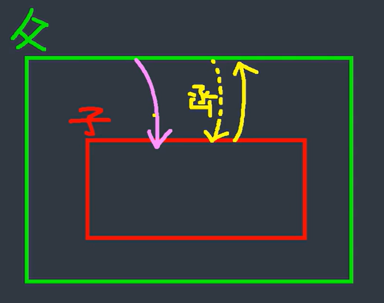

# 6.通信组件

**`Vue3`****组件通信和****`Vue2`****的区别：**

- 移出事件总线，使用`mitt`代替。
- `vuex`换成了`pinia`。
- 把`.sync`优化到了`v-model`里面了。
- 把`$listeners`所有的东西，合并到`$attrs`中了。
- `$children`被砍掉了。

**常见搭配形式：**



## 1.props

概述：`props`是使用频率最高的一种通信方式，常用与 ：**父 ↔ 子**。

- 若 **父传子**：属性值是**非函数**。
- 若 **子传父**：属性值是**函数**。



父组件：

```vue 
<template>
  <div class="father">
    <h3>父组件，</h3>
    <h4>我的车：{{ car }}</h4>
    <h4>儿子给的玩具：{{ toy }}</h4>
    <Child :car="car" :getToy="getToy"/>
  </div>
</template>

<script setup lang="ts" name="Father">
  import Child from './Child.vue'
  import { ref } from "vue";
  // 数据
  const car = ref('奔驰')
  const toy = ref()
  // 方法
  function getToy(value:string){
    toy.value = value
  }
</script>
```


子组件

```vue 
<template>
  <div class="child">
    <h3>子组件</h3>
    <h4>我的玩具：{{ toy }}</h4>
    <h4>父给我的车：{{ car }}</h4>
    <button @click="getToy(toy)">玩具给父亲</button>
  </div>
</template>

<script setup lang="ts" name="Child">
  import { ref } from "vue";
  const toy = ref('奥特曼')
  
  defineProps(['car','getToy'])
</script>
```


## 2.自定义事件

概述：自定义事件常用于：**子 => 父****。**

注意区分好：原生事件、自定义事件。

- 原生事件：
  - 事件名是特定的（`click`、`mosueenter`等等）
  - 事件对象`$event`: 是包含事件相关信息的对象（`pageX`、`pageY`、`target`、`keyCode`）
- 自定义事件：
  - 事件名是任意名称
  - \<strong style="color:red">事件对象`$event`: 是调用`emit`时所提供的数据，可以是任意类型！！！\</strong >

示例：

```html 
<!--在父组件中，给子组件绑定自定义事件：-->
<Child @send-toy="toy = $event"/>

<!--注意区分原生事件与自定义事件中的$event-->
<button @click="toy = $event">测试</button>
```


```typescript 
//子组件中，触发事件：
this.$emit('send-toy', 具体数据)
```


父组件

```react jsx 
<template>
  <div class="father">
    <h3>父组件</h3>
    <h4 v-show="toy">子给的玩具：{{ toy }}</h4>
    <!-- 给子组件Child绑定事件 -->
    <Child @send-toy="saveToy"/>
  </div>
</template>

<script setup lang="ts" name="Father">
  import Child from './Child.vue'
  import { ref } from "vue";
  // 数据
  let toy = ref('')
  // 用于保存传递过来的玩具
  function saveToy(value:string){
    console.log('saveToy',value)
    toy.value = value
  }
</script>
```


子组件

```react jsx 
<template>
  <div class="child">
    <h3>子组件</h3>
    <h4>玩具：{{ toy }}</h4>
    <button @click="emit('send-toy',toy)">测试</button>
  </div>
</template>

<script setup lang="ts" name="Child">
  import { ref } from "vue";
  // 数据
  let toy = ref('奥特曼')
  // 声明事件
  const emit =  defineEmits(['send-toy'])
</script>
```


## 3.mitt

概述：与消息**订阅与发布**（`pubsub`）功能类似，可以**实现任意组件间通信**。

- 接受数据的：提前绑定好事件（提前订阅消息）
- 提供数据的：在合适的时候触发事件（发布消息）

### 3.1 通信流程

（1）安装`mitt`

```bash 
npm i mitt
```


（2）新建文件：`src\utils\emitter.ts`

`const emitter = mitt()`事件类型：

- `all`: 拿到所有绑定的事件
- `emit`: 触发某一事件
- `off`: 解绑某一事件
- `on`: 绑定某一事件

```javascript 
// 引入mitt 
import mitt from "mitt";

// 创建emitter
const emitter = mitt()

/*
  // 绑定事件
  emitter.on('abc',(value)=>{
    console.log('abc事件被触发',value)
  })
  emitter.on('xyz',(value)=>{
    console.log('xyz事件被触发',value)
  })

  setInterval(() => {
    // 触发事件
    emitter.emit('abc',666)
    emitter.emit('xyz',777)
  }, 1000);

  setTimeout(() => {
    // 清理事件
    emitter.all.clear()
  }, 3000); 
*/

// 创建并暴露mitt
export default emitter
```


（3）接收数据的组件中：绑定事件、同时在销毁前解绑事件：

```typescript 
import emitter from "@/utils/emitter";
import { onUnmounted } from "vue";

// 绑定事件
emitter.on('send-toy',(value)=>{
  console.log('send-toy事件被触发',value)
})

onUnmounted(()=>{
  // 解绑事件
  emitter.off('send-toy')
})
```


（4）提供数据的组件，在合适的时候触发事件

```javascript 
import emitter from "@/utils/emitter";

function sendToy(){
  // 触发事件
  emitter.emit('send-toy',toy.value)
}
```


**注意这个重要的内置关系，总线依赖着这个内置关系**

### 3.2 示例

三个组件：父组件，子组件1和子组件2，子组件1和2进行通信

父组件

```react jsx 
<template>
  <div class="father">
    <h3>父组件</h3>
    <Child1/>
    <Child2/>
  </div>
</template>

<script setup lang="ts" name="Father">
  import Child1 from './Child1.vue'
  import Child2 from './Child2.vue'
</script>
```


子组件1

```react jsx 
<template>
  <div class="child1">
    <h3>子组件1</h3>
    <h4>玩具：{{ toy }}</h4>
    <button @click="emitter.emit('send-toy',toy)">玩具给弟弟</button>
  </div>
</template>

<script setup lang="ts" name="Child1">
  import {ref} from 'vue'
  import emitter from '@/utils/emitter';

  // 数据
  let toy = ref('奥特曼')
</script>
```


子组件2（注意组件卸载时，事件的解绑）

```react jsx 
<template>
  <div class="child2">
    <h3>子组件2</h3>
    <h4>电脑：{{ computer }}</h4>
    <h4>哥哥给的玩具：{{ toy }}</h4>
  </div>
</template>

<script setup lang="ts" name="Child2">
  import {ref, onUnmounted} from 'vue'
  import emitter from '@/utils/emitter';
  // 数据
  let computer = ref('联想')
  let toy = ref('')

  // 给emitter绑定send-toy事件
  emitter.on('send-toy',(value:any)=>{
    toy.value = value
  })
  // 在组件卸载时解绑send-toy事件
  onUnmounted(()=>{
    emitter.off('send-toy')
  })
</script>
```


## 4.v-model

1. 概述：实现 **父↔子** 之间相互通信。
2. 前序知识 —— `v-model`的本质
   ```vue 
   <!-- 使用v-model指令 -->
   <input type="text" v-model="userName">

   <!-- v-model的本质是下面这行代码 -->
   <input 
     type="text" 
     :value="userName" 
     @input="userName =(<HTMLInputElement>$event.target).value"
   >
   ```

3. 组件标签上的`v-model`的本质：`:moldeValue` ＋ `update:modelValue`事件。
   ```vue 
   <!-- 组件标签上使用v-model指令 -->
   <AtguiguInput v-model="userName"/>

   <!-- 组件标签上v-model的本质 -->
   <AtguiguInput :modelValue="userName" @update:model-value="userName = $event"/>
   ```

   `AtguiguInput`组件中：
   ```vue 
   <template>
     <div class="box">
       <!--将接收的value值赋给input元素的value属性，目的是：为了呈现数据 -->
       <!--给input元素绑定原生input事件，触发input事件时，进而触发update:model-value事件-->
       <input 
          type="text" 
          :value="modelValue" 
          @input="emit('update:model-value',$event.target.value)"
       >
     </div>
   </template>

   <script setup lang="ts" name="AtguiguInput">
     // 接收props
     defineProps(['modelValue'])
     // 声明事件
     const emit = defineEmits(['update:model-value'])
   </script>
   ```

4. 也可以更换`value`，例如改成`abc`
   ```vue 
   <!-- 也可以更换value，例如改成abc-->
   <AtguiguInput v-model:abc="userName"/>

   <!-- 上面代码的本质如下 -->
   <AtguiguInput :abc="userName" @update:abc="userName = $event"/>
   ```

   `AtguiguInput`组件中：
   ```vue 
   <template>
     <div class="box">
       <input 
          type="text" 
          :value="abc" 
          @input="emit('update:abc',$event.target.value)"
       >
     </div>
   </template>

   <script setup lang="ts" name="AtguiguInput">
     // 接收props
     defineProps(['abc'])
     // 声明事件
     const emit = defineEmits(['update:abc'])
   </script>
   ```

5. 如果`value`可以更换，那么就可以在组件标签上多次使用`v-model`
   ```vue 
   <AtguiguInput v-model:abc="userName" v-model:xyz="password"/>
   ```


注意：`$event`到底是啥？啥时候能 `.target`

- 对于原生事件，`$event`就是事件对象 → 能`.target`
- 对于自定义事件，`$event` 就是出发事件时，所传递的数据 → 不能`.target`

## 5.`$attrs`&#x20;

1. 概述：`$attrs`用于实现**当前组件的父组件**，向**当前组件的子组件**通信（**祖→孙**）。
2. 具体说明：`$attrs`是一个对象，包含所有父组件传入的标签属性。
   > 注意：`$attrs`会自动排除`props`中声明的属性(可以认为声明过的 `props` 被子组件自己“消费”了)

父组件：

```vue 
<template>
  <div class="father">
    <h3>父组件</h3>
    <Child :a="a" :b="b" :c="c" :d="d" v-bind="{x:100,y:200}" :updateA="updateA"/>
  </div>
</template>

<script setup lang="ts" name="Father">
  import Child from './Child.vue'
  import { ref } from "vue";
  let a = ref(1)
  let b = ref(2)
  let c = ref(3)
  let d = ref(4)

  function updateA(value){
    a.value = value
  }
</script>
```


子组件：

```vue 
<template>
  <div class="child">
    <h3>子组件</h3>
    <GrandChild v-bind="$attrs"/>
  </div>
</template>

<script setup lang="ts" name="Child">
  import GrandChild from './GrandChild.vue'
</script>
```


孙组件：

```vue 
<template>
  <div class="grand-child">
    <h3>孙组件</h3>
    <h4>a：{{ a }}</h4>
    <h4>b：{{ b }}</h4>
    <h4>c：{{ c }}</h4>
    <h4>d：{{ d }}</h4>
    <h4>x：{{ x }}</h4>
    <h4>y：{{ y }}</h4>
    <button @click="updateA(666)">点我更新A</button>
  </div>
</template>

<script setup lang="ts" name="GrandChild">
  defineProps(['a','b','c','d','x','y','updateA'])
</script>
```


## 6.`$refs`、`$parent`

1. 概述：
   - `$refs`用于 ：**父→子。**
   - `$parent`用于：**子→父。**
2. 原理如下：
   | 属性            | 说明                                    |
   | ------------- | ------------------------------------- |
   | \`\$refs\`    | 值为对象，包含所有被\`ref\`属性标识\`DOM\`元素或组件实例。  |
   | \`\$parent\`  | 值为对象，当前组件的父组件实例对象。                    |

父组件：

```javascript 
<template>
  <div class="father">
    <h3>父组件</h3>
    <h4>房产：{{ house }}</h4>
    <button @click="changeToy">修改Child1的玩具</button>
    <button @click="changeComputer">修改Child2的电脑</button>
    <button @click="getAllChild($refs)">让所有孩子的书变多</button>
    <Child1 ref="c1"/>
    <Child2 ref="c2"/>
  </div>
</template>

<script setup lang="ts" name="Father">
  import Child1 from './Child1.vue'
  import Child2 from './Child2.vue'
  import { ref,reactive } from "vue";
  let c1 = ref()
  let c2 = ref()  

  // 数据
  let house = ref(4)
  // 方法
  function changeToy(){
    c1.value.toy = '小猪佩奇'
  }
  function changeComputer(){
    c2.value.computer = '华为'
  }
  function getAllChild(refs:{[key:string]:any}){
    console.log(refs)
    for (let key in refs){
      refs[key].book += 3
    }
  }
  // 向外部提供数据
  defineExpose({house})
</script>
```


子组件1：

```react jsx 
<template>
  <div class="child1">
    <h3>子组件1</h3>
    <h4>玩具：{{ toy }}</h4>
    <h4>书籍：{{ book }} 本</h4>
    <button @click="minusHouse($parent)">干掉父亲的一套房产</button>
  </div>
</template>

<script setup lang="ts" name="Child1">
  import { ref } from "vue";
  // 数据
  let toy = ref('奥特曼')
  let book = ref(3)

  // 方法
  function minusHouse(parent:any){
    parent.house -= 1
  }

  // 把数据交给外部
  defineExpose({toy, book})

</script>
```


子组件2：

```react jsx 
<template>
  <div class="child2">
    <h3>子组件2</h3>
    <h4>电脑：{{ computer }}</h4>
    <h4>书籍：{{ book }} 本</h4>
  </div>
</template>

<script setup lang="ts" name="Child2">
    import { ref } from "vue";
    // 数据
    let computer = ref('联想')
    let book = ref(6)
    // 把数据交给外部
    defineExpose({computer,book})
</script>
```


## 7.provide、inject

1. 概述：实现**祖孙组件**直接通信
2. 具体使用：
   - 在祖先组件中通过`provide`配置向后代组件提供数据
   - 在后代组件中通过`inject`配置来声明接收数据
3. 具体编码：
   【第一步】父组件中，使用`provide`提供数据
   ```vue 
   <template>
     <div class="father">
       <h3>父组件</h3>
       <h4>资产：{{ money }}</h4>
       <h4>汽车：{{ car }}</h4>
       <button @click="money += 1">资产+1</button>
       <button @click="car.price += 1">汽车价格+1</button>
       <Child/>
     </div>
   </template>

   <script setup lang="ts" name="Father">
     import Child from './Child.vue'
     import { ref,reactive,provide } from "vue";
     // 数据
     let money = ref(100)
     let car = reactive({
       brand:'奔驰',
       price:100
     })
     // 用于更新money的方法
     function updateMoney(value:number){
       money.value += value
     }
     // 提供数据
     // provide(名，变量)
     provide('moneyContext',{money,updateMoney})
     provide('car',car)
   </script>
   ```

   > 注意：子组件中不用编写任何东西，是不受到任何打扰的
   【第二步】孙组件中使用`inject`配置项接受数据。
   ```vue 
   <template>
     <div class="grand-child">
       <h3>我是孙组件</h3>
       <h4>资产：{{ money }}</h4>
       <h4>汽车：{{ car }}</h4>
       <button @click="updateMoney(6)">点我</button>
     </div>
   </template>

   <script setup lang="ts" name="GrandChild">
     import { inject } from 'vue';
     // 注入数据
     // inject(名，默认值)
    let {money,updateMoney} = inject('moneyContext',{money:0,updateMoney:(x:number)=>{}})
     let car = inject('car')
    </script>
   ```


## 8.pinia

参考之前`pinia`部分的讲解

## 9.slot

### 9.1 默认插槽


父组件

```javascript 
<template>
  <div class="father">
    <h3>父组件</h3>
    <div class="content">
      <Category title="热门游戏列表">
        <ul>
          <li v-for="g in games" :key="g.id">{{ g.name }}</li>
        </ul>
      </Category>

      <Category title="今日美食城市">
        
      </Category>
      
      <Category title="今日影视推荐">
        <video :src="videoUrl" controls></video>
      </Category>
    </div>
  </div>
</template>

<script setup lang="ts" name="Father">
  import Category from './Category.vue'
  import { ref,reactive } from "vue";

  let games = reactive([
    {id:'asgytdfats01',name:'英雄联盟'},
    {id:'asgytdfats02',name:'王者农药'},
    {id:'asgytdfats03',name:'红色警戒'},
    {id:'asgytdfats04',name:'斗罗大陆'}
  ])
  let imgUrl = ref('https://z1.ax1x.com/2023/11/19/piNxLo4.jpg')
  let videoUrl = ref('http://clips.vorwaerts-gmbh.de/big_buck_bunny.mp4')

</script>
```


子组件

```react jsx 
<template>
  <div class="category">
    <h2>{{title}}</h2>
    <slot>默认内容</slot>
  </div>
</template>

<script setup lang="ts" name="Category">
  defineProps(['title'])
</script>
```


### 9.2 具名插槽

- 具有名字的插槽

父组件：

```javascript 
<template>
  <div class="father">
    <h3>父组件</h3>
    <div class="content">
      <Category>
        <template v-slot:s2>
          <ul>
            <li v-for="g in games" :key="g.id">{{ g.name }}</li>
          </ul>
        </template>
        <template v-slot:s1>
          <h2>热门游戏列表</h2>
        </template>
      </Category>

      <Category>
        <template v-slot:s2>
          
        </template>
        <template v-slot:s1>
          <h2>今日美食城市</h2>
        </template>
      </Category>

      <Category>
        <template #s2>
          <video video :src="videoUrl" controls></video>
        </template>
        <template #s1>
          <h2>今日影视推荐</h2>
        </template>
      </Category>
    </div>
  </div>
</template>

<script setup lang="ts" name="Father">
  import Category from './Category.vue'
  import { ref,reactive } from "vue";

  let games = reactive([
    {id:'asgytdfats01',name:'英雄联盟'},
    {id:'asgytdfats02',name:'王者农药'},
    {id:'asgytdfats03',name:'红色警戒'},
    {id:'asgytdfats04',name:'斗罗大陆'}
  ])
  let imgUrl = ref('https://z1.ax1x.com/2023/11/19/piNxLo4.jpg')
  let videoUrl = ref('http://clips.vorwaerts-gmbh.de/big_buck_bunny.mp4')

</script>
```


子组件：

```react jsx 
<template>
  <div class="category">
    <slot name="s1">默认内容1</slot>
    <slot name="s2">默认内容2</slot>
  </div>
</template>

<script setup lang="ts" name="Category">
  
</script>
```


### 9.3 作用域插槽

理解：`<span style="color:red">`数据在组件的自身，但根据数据生成的结构需要组件的使用者来决定。`</span>`（新闻数据在`News`组件中，但使用数据所遍历出来的结构由`App`组件决定）

- 数组在子组件那面，但根据数据生成的结构，却由父组件决定

父组件：

```javascript 
<template>
  <div class="father">
    <h3>父组件</h3>
    <div class="content">
      <Game>
        <template v-slot="params">
          <ul>
            <li v-for="y in params.youxi" :key="y.id">
              {{ y.name }}
            </li>
          </ul>
        </template>
      </Game>

      <Game>
        <template v-slot="params">
          <ol>
            <li v-for="item in params.youxi" :key="item.id">
              {{ item.name }}
            </li>
          </ol>
        </template>
      </Game>

      <Game>
        <template #default="{youxi}">
          <h3 v-for="g in youxi" :key="g.id">{{ g.name }}</h3>
        </template>
      </Game>

    </div>
  </div>
</template>

<script setup lang="ts" name="Father">
  import Game from './Game.vue'
</script>
```


子组件：

```react jsx 
<template>
  <div class="game">
    <h2>游戏列表</h2>
    <slot :youxi="games" x="哈哈" y="你好"></slot>
  </div>
</template>

<script setup lang="ts" name="Game">
  import {reactive} from 'vue'
  let games = reactive([
    {id:'asgytdfats01',name:'英雄联盟'},
    {id:'asgytdfats02',name:'王者农药'},
    {id:'asgytdfats03',name:'红色警戒'},
    {id:'asgytdfats04',name:'斗罗大陆'}
  ])
</script>
```


