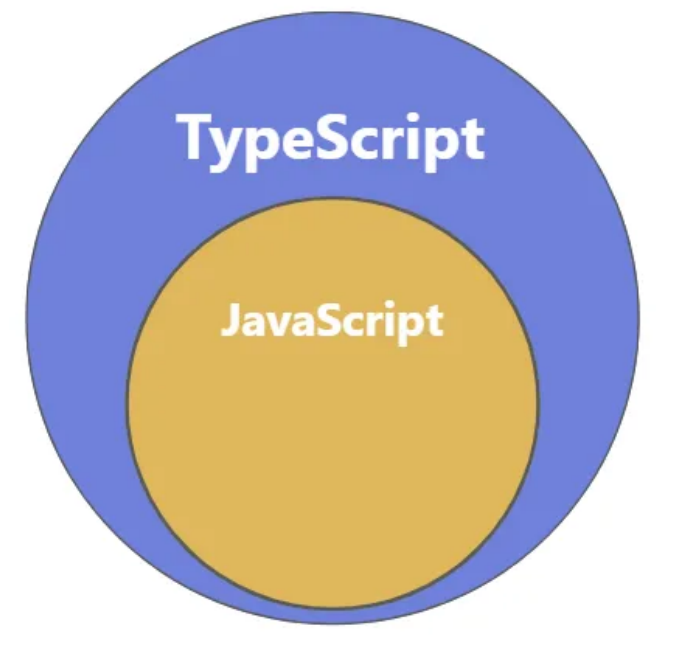

# 1.TS简介



## 1.TypeScript 简介

1. `TypeScript `由微软开发，是基于 JavaScript 的⼀个扩展语言。
2. `TypeScript` 包含了 `JavaScript` 的所有内容，即： `TypeScript `是 `JavaScript `的超集。
3. `TypeScript `增加了：静态类型检查、接口、 泛型等很多现代开发特性，更适合大型项目的开发。
4. `TypeScript `需要编译为 `JavaScript `，然后交给浏览器或其他 `JavaScript `运行环境执行。

## 2.为何需要 TypeScript

### 2.1今非昔比的 JavaScript(了解)

- JavaScript 当年诞生时的定位是浏览器**脚本语言**，用于在网页中嵌入**简单的逻辑**，且代码量很少。
- 随着时间的推移，JavaScript 变得越来越流行，如今的 JavaScript 已经可以**全栈编程** 了。
- 现如今的 JavaScript 应用场景比当年丰富的多，代码量也比当年大很多，随便⼀个 JavaScript 项目的代码量，可以轻松的达到几万行，甚⾄十几万行!
- 然而 JavaScript 当年"**出生简陋**"，没考虑到如今的应用场景和代码量，逐渐就出现了很多困扰。

### 2.2 JavaScript 中的困扰

#### （1）不清楚的数据类型

```javascript 
let welcome = 'hello' 
welcome() // 此⾏报错:TypeError: welcome is not a function
```


#### （2）有漏洞的逻辑

```typescript 
const str = Date.now() % 2 ? '奇数' : '偶数'
if (str !== '奇数'){
  alert('hello') 
}else if(str === '偶数'){
  alert('world') }
```


#### （3）访问不存在的属性

```javascript 
const obj = { width: 10, height: 15 }; 
const area = obj.width * obj.heigth;
```


#### （4） 低级的拼写错误

```javascript 
const message = 'hello,world' message.toUperCase() //遗漏了一个"p"
```


### 2.3 静态类型检查

- 在代码运行前进行检查，发现代码的错误或不合理之处，减小运行时出现异常的几率，此种检 查叫『**静态类型检查**』,TypeScript 和核心就是『静态类型检查』，简而言之就是**把运行时的错误前置**
- 同样的功能,TypeScript 的代码量要大于 JavaScript，但由于 TypeScript 的代码结构更加清晰，在后期代码的维护中 TypeScript 却胜于 JavaScript

## 3.编译 TypeScript

浏览器不能直接运行 TS 代码，需要编译为JS 代码，再交由浏览器解析执行

### 3.1命令⾏编译

要把 `.ts` ⽂件编译为 `.js` ⽂件,需要配置 TypeScript 的编译环境,步骤如下:

- 第⼀步：创建⼀个` demo.ts` ⽂件,例如:

```javascript 
const person = {
  name: '李四',
  age: 18
}
console.log(`我叫${person.name}，我今年${person.age}岁了`)
```


- 第二步：全局安装 TypeScript  `npm i typescript -g`
- 第三步：使用命令编译 .ts ⽂件`tsc demo.ts`

### 3.2 自动化编译

- 第⼀步：创建 TypeScript 编译控制文件：
  ```bash 
  tsc --init
  ```

- 第⼆步：监视目录中的 `.ts` 文件变化
  ```bash 
  tsc --watch 
  tsc -w
  ```

- 第三步：小优化,当编译出错时不生成 `.js` ⽂件&#x20;
  ```bash 
  tsc --noEmitOnError --watch
  ```

  - 备注:当然也可以修改`tsconfig.json` 中的 noEmitOnError 配置

## 4.类型声明

使用: 来对变量或函数形参，进行类型声明:

```typescript 
let a: string   // 变量a只能存储字符串
let b: number   // 变量b只能存储数值
let c: boolean  // 变量c只能存储布尔值
​
a = 'hello'
a = 100         // 警告: 不能将类型“number”分配给类型“string”
​
b = 666
b = '你好'      // 警告: 不能将类型"string"分配给类型"number"
​
c = true
c = 666         // 警告: 不能将类型“number”分配给类型“boolean”
​
// 参数x必须是数字，参数y也必须是数字，函数返回值也必须是数字
function demo(x: number, y: number): number {
  return x + y
}

demo(100, 200)
demo(100, '200')    // 警告: 类型“string"的参数不能赋给类型"number"的参数
demo(100, 200, 300) // 警告: 应有 2个参数, 但获得 3个
demo(100)           // 警告: 应有 2个参数，但获得 1个
```


在 `:` 后也可以写字面量类型，不过实际开发中用的不多。

```typescript 
let a: '你好' //a的值只能为字符串"你好"
let b: 100   //b的值只能为数字100
a = '欢迎'    //警告:不能将类型""欢迎""分配给类型""你好""
b = 200       //警告:不能将类型"200"分配给类型"100"
```


## 5.类型推断

**TS 会根据我们的代码，进行类型推导,例如下面代码中的变量 d ,只能存储数字**

```typescript 
let d = -99   //TypeScript会推断出变量d的类型是数字
d = false     //警告:不能将类型"boolean"分配给类型"number"
```


但要注意,类型推断不是万能的，面对复杂类型时推断容易出问题，所以尽量还是明确的编写类型声明!

## 6.类型总览

### 6.1 JavaScript 中的数据类型

1. `string`&#x20;
2. `number`
3. `boolean `
4. `null `
5. `undefined `
6. `bigint `
7. `symbol `
8. `object`

备注：其中 `object `包含: `Array `、 `Function `、 `Date `、 `Error `等......

### 6.2 TypeScript 中的数据类型

1. 上述所有 JavaScript 类型
2. 六个新类型： ① `any` ② `unknown` ③ `never` ④ `void` ⑤ `tuple` ⑥ `enum`
3. 两个用于自定义类型的方式： ① `type` ② `interface`

### 6.3 注意点

在 JavaScript 中的这些内置构造函数: `Number` 、 `String` 、 `Boolean` ，用于创建对应的包装对象, 在日常开发时很少使用，在 TypeScript 中也是同理，所以在 TypeScript 中进行类型声明时，通常都是用小写的 `number` 、 `string` 、 `boolean`

例如下面代码:

```typescript 
let str1: string //TS官方推荐的写法
str1 = 'hello'
str1 = new String('hello') //包

let str2: String
str2 = 'hello'
str2 = new String('hello'
 
console.log(typeof str1)
console.log(typeof str2)
```


1. **原始类型 VS 包装对象**
   - 原始类型：如 number 、 string 、 boolean ,在 JavaScript 中是简单数据类型，它们在内存中占用空间少，处理速度快。
   - 包装对象：如 Number 对象、 String 对象、 Boolean 对象,是复杂类型,在内存中占用更多空间，在日常开发时很少由开发人员自己创建包装对象。
2. 自动装箱：JavaScript 在必要时会自动将原始类型包装成对象，以便调用方法或访问属性

```javascript 
// 原始类型字符串
let str = 'hello';
// 当访问str.length时,JavaScript引擎做了以下⼯作:
// 1. ⾃动装箱:创建⼀个临时的String对象包装原始字符串
let size = (function(){
  let tempStringObject = new String(str);
  // 2. 访问String对象的length属性
  let lengthValue = tempStringObject.length;
  // 3. 销毁临时对象,返回⻓度值
  // (JavaScript引擎⾃动处理对象销毁,开发者⽆感知)
  return lengthValue;
})();

console.log(size); // 输出: 5
```
